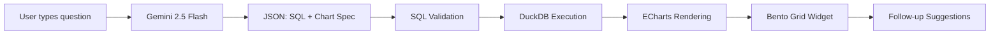

# LARPGODS NR2 Dashboard — Ask Your Data Anything

> Natural-language powered analytics dashboard for banking voicebot data.  
> Type a question → get a beautiful chart. No SQL required.

**Live URL:** [coming soon]

  

---

## Problem & Approach

Every business has data, but almost nobody can ask it questions without SQL expertise. We built **LARPGODS NR2 Dashboard** — a natural-language data exploration tool that turns plain-English (or Greek) questions into stunning, interactive dashboard widgets in real-time.

**What makes us different:** We didn't build a chatbot. We built a **Dynamic Bento Box** — a spatial data HUD where each question generates a glassmorphic widget tile that snaps into an auto-arranging grid. The result is a bespoke dashboard built in real-time through conversation.

### Architecture

```
User Question → Gemini 2.5 Flash → SQL + Chart Spec → DuckDB Execution → ECharts Rendering
```



**Key design decisions:**
- **Monolithic FastAPI** — single deploy target, no cross-service networking
- **Zero query-pattern examples** in the system prompt — avoids biasing the LLM toward specific patterns, enabling generalization to novel queries
- **Framework, not templates** — the LLM freely composes chart specs from primitives (bar, line, area, pie, KPI, table)
- **SQL retry loop** — up to 3 attempts with error context on SQL failures
- **Read-only safety** — SQL is validated before execution (no INSERT/UPDATE/DELETE/DROP)

## Quick Start

```bash
# Clone
git clone https://github.com/your-team/makeathon-2026-smartrep.git
cd makeathon-2026-smartrep

# Install dependencies
pip install -r requirements.txt

# Set your Gemini API key
cp .env.example .env
# Edit .env and paste your GEMINI_API_KEY

# Run
python -m uvicorn app.main:app --host 0.0.0.0 --port 8000 --reload
```

Open [http://localhost:8000](http://localhost:8000) and start asking questions.

## Features

| Feature | Status |
|---------|--------|
| Natural-language to SQL | ✅ |
| 6 chart types (bar, line, area, pie, KPI, table) | ✅ |
| Multi-panel dashboards for open-ended queries | ✅ |
| Conversational follow-ups with context | ✅ |
| Greek + English support | ✅ |
| SQL retry on error (3 attempts) | ✅ |
| Read-only SQL safety validation | ✅ |
| Dark mode glassmorphic UI | ✅ |
| Animated widget grid (Bento Box) | ✅ |
| SQL inspection panel | ✅ |
| Follow-up query suggestions | ✅ |
| Demo mode (no API key needed) | ✅ |

## Example Queries

- "Show me containment rate by intent"
- "Daily call volume over the last 90 days"
- "How is the bot doing this week?"
- "Compare bot version 2.2.1 vs 2.3.0 performance"
- "Average CSAT by customer segment"
- "Which intents have the highest escalation rate?"
- "Δείξε μου τα ποσοστά ανά γλώσσα" (Greek)

## Tech Stack

| Layer | Technology |
|-------|-----------|
| Backend | FastAPI (Python 3.9+) |
| Database | DuckDB (in-process, pre-built dataset) |
| LLM | Gemini 2.5 Flash via REST API |
| Charts | Apache ECharts 5.5 |
| Frontend | Vanilla HTML/CSS/JS (no build step) |
| Styling | Custom dark-mode design system |
| Validation | Pydantic v2 (backend), manual SQL safety checks |

## Dataset

Pre-built synthetic banking voicebot dataset:
- ~10,000 conversations over 90 days
- 5 flat SQL views: `v_conversations`, `v_turns`, `v_evaluations`, `v_data_collection`, `v_tool_calls`
- English + Greek language data
- Embedded patterns: seasonality, release step-change, anomaly window, regional variation

## Limitations

- Single-session context (no persistence across page reloads)
- Chart type selection relies on LLM judgment (occasionally suboptimal)
- No authentication (optimized for evaluation; production would add OAuth)
- Dataset is fixed/synthetic — no live data integration

## Future Work

- Voice-controlled queries (Gemini Live API)
- Multi-dataset support
- Dashboard versioning and export
- Collaborative shared dashboards
- On-premise deployment option

## License

MIT
